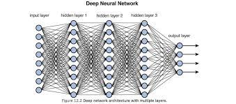

# Understanding Deep Learning Model Performance

## Overview
Student Name: Thotadamoole Shreenidhi
Homework 21: Deep Learning Challenge
The nonprofit foundation Alphabet Soup wants a tool that can help it select the applicants for funding with the best chance of success in their ventures. With your knowledge of machine learning and neural networks, you’ll use the features in the provided dataset to create a binary classifier that can predict whether applicants will be successful if funded by Alphabet Soup.

## Results

### Data Preprocessing

#### What variable(s) are the target(s) for your model?
* The 'IS_SUCCESSFUL' column from application_df is our target variable, and target variable is the one that we are trying to predict. TIS_SUCCESSFUL' column indicates if the money was used effectively.
  
#### What variable(s) are the features for your model?
* The feature variables we used are:
  1. AFFILIATION—Affiliated sector of industry
  2. CLASSIFICATION—Government organization classification
  3. USE_CASE—Use case for funding
  4. ORGANIZATION—Organization type
  5. STATUS—Active status
  6. INCOME_AMT—Income classification
  7. SPECIAL_CONSIDERATIONS—Special considerations for application
  8. ASK_AMT—Funding amount requested

#### What variable(s) should be removed from the input data because they are neither targets nor features?
* Identification columns: The "EIN" and "NAME" columns were removed. These columns usually have no direct impact on the target variable and can be dropped without affecting the model's accuracy.

### Compiling, Training, and Evaluating the Model

#### How many neurons, layers, and activation functions did you select for your neural network model, and why?
* In  first model, I used a two-layer architecture with a specific choice for the number of neurons, layers, and activation functions.

* By selecting 80 neurons in the first hidden layer (units_1 = 80), 80 neurons in the second hidden layer (units_2 = 80), and using the ReLU activation function (activation="relu") for both hidden layers, you aimed to create a model with sufficient complexity to capture and learn meaningful patterns in the data. The choice of ReLU activation helps introduce non-linearity and allows the model to learn complex relationships between the input features and the target variable.

* We have used a single neuron in the output layer (units=1) with a sigmoid activation function (activation="sigmoid") to model the binary classification problem. The sigmoid activation function maps the output to a range between 0 and 1, representing the probability of the positive class.

* The model architecture with the chosen number of neurons, layers, and activation functions aimed to strike a balance between complexity and simplicity, allowing the model to learn and generalize well on the given classification task.

#### Were you able to achieve the target model performance?
* As per the results, we were able to achieve 73.64% accuracy in our first model is that value is below our target of 75% 

#### What steps did you take in your attempts to increase model performance?
1. Increasing the number of neurons and epochs:
   

* By increasing the number of neurons in a layer, the model becomes more expressive and can capture complex patterns in the data. This allows for better representation of the underlying relationships between the features and the target variable, potentially leading to higher accuracy.
* Increasing the number of epochs gives the model more opportunities to learn from the data and adjust the weights. It allows the model to refine its predictions and find better parameter values, which can lead to improved accuracy. However, it's important to find a balance as increasing epochs excessively can lead to overfitting.

* In second model our accurecy slightly increased to 73.79% and was still short of 75%

2. Using a different activation function (tanh for the second layer):
   

* Introducing a different activation function, such as tanh, can affect how the model interprets and transforms the inputs. Different activation functions have different properties and can capture different types of non-linearities. By using tanh, it introduce a different non-linearity that may better suit the problem at hand, potentially leading to increased accuracy. As we wanted to increase the accuracy, we tried this method.

* For our data, using tanah did not result in any increase of the accuracy. We ended with 73.77% after 100 epocs

3. Utilizing an Automated Optimiser (such as a hyperparameter tuner):
   

* Automated optimisers, like hyperparameter tuners, systematically explore various combinations of hyperparameters, such as activation functions, number of layers, number of neurons, and epochs. This exploration can help identify the most optimal combination of hyperparameters for your specific problem, potentially leading to higher accuracy. It saves you from manually trying out different combinations and allows the optimiser to leverage its search algorithms to find the best configuration.
  

* As we see, even after using the automated tuning, our accuracy remained at 73.86% and was still short from 75%.

## Conclusion
The heighest accuracy that we have obtained was at 73.86% as part of the tuning. We can consider the below steps to futher improve:

1. Adding more data:
   * Increasing the size of the training dataset can help the model learn from a larger and more diverse set of examples. 
  
2. Data cleaning:
   * Having clean data is crucial for model performance. Cleaning includes handling missing values, handling outliers, normalizing or standardizing features, and addressing any data quality issues. By thoroughly reviewing and cleaning the data, I can mitigate the impact of noise or irrelevant information that might be affecting the model's accuracy.
  
3. Exploring alternative machine learning algorithms:
   * Trying a different algorithm, such as Random Forest, can provide valuable insights into the importance of different features. Random Forest can measure feature importance based on how effectively each feature contributes to the overall prediction. This analysis can help identify the key predictor columns, allowing you to focus on the most informative features and potentially improve accuracy.

4. Identifying feature importance and selecting relevant attributes:
   * Analysing feature importance helps determine which attributes have the most significant impact on the output. By identifying and selecting the most important attributes, you can reduce the noise and complexity in the model. Focusing on the most relevant features can enhance the model's ability to capture meaningful patterns and improve accuracy.
  
5. Binning the data:
   * Binning continuous variables can be useful in certain scenarios. It can help simplify the relationship between variables and the target variable by grouping similar values into bins. This can reduce the complexity of the model and make it more robust to noise or fluctuations in the data, potentially leading to improved accuracy.

In summary, to improve the deep learning model's performance, I would consider adding more data, ensuring proper data cleaning, exploring alternative algorithms, identifying feature importance, and applying data binning techniques. 

